现有一个基于vue-cli2的项目（不支持ES新语法，使用ElementUI组件库），目前vue-cli已经迭代到4版本，且已经处于维护模式；vue2在2023年底终止支持，vue2.7是最后一个版本。所以打算即升级现有项目至vue3（使用ElementPlus组件库）。

## 技术分析

[GoGoCode](https://gogocode.io/zh)是一个由阿里妈妈开源的基于 AST 的 JavaScript/Typescript/HTML 代码转换工具，通过分析词法分析、语法分析、语义分析等，直接编译Vue2代码至Vue3。
根据GoGoCode文档介绍，目前 GoGoCode 仅支持新版本 vue-cli ，对于 vue-cli2 的项目不能进行编译处理，所以处理思路就是：

```
vue-cli2 ---(手动复制文件并解决错误)---> vue-cli4 ---(使用gogocode编译)---> Vue3
```

根据GoGoCode官网给出文档[vue-cli2的项目升级到vue-cli4做了哪些事情](https://blog.liuyunzhuge.com/2019/12/19/vue-cli2%E7%9A%84%E9%A1%B9%E7%9B%AE%E5%8D%87%E7%BA%A7%E5%88%B0vue-cli4%E5%81%9A%E4%BA%86%E5%93%AA%E4%BA%9B%E4%BA%8B%E6%83%85/)手动复制文件升级至vue-cli4，根据[Vue2 到 Vue3 升级指南](https://gogocode.io/zh/docs/vue/vue2-to-vue3)及[Element UI 到 Element Plus 升级指南](https://gogocode.io/zh/docs/vue/element-ui-to-element-plus)升级至Vue3

## 主要流程

#### 升级vue-cli2至vue-cli4

###### 流程

1. 拿到源码新建分支vuecli4，在vuecli4分支使用 `vue create` 命令新建一个vuecli4的空项目（必须是vuecli4的项目），把vuecli2项目中的 `src` 源码目录及 `index.html` 模版复制到vuecli4项目中
2. 直接运行项目，根据报错提示进行反复重启（安装依赖、webpack配置、eslint配置等）

###### 期间遇到的问题

1. Cant't resolve 'xxxx' in filename


直接安装相应依赖，再次运行项目（使用less需要同时安装less和less-loader、）

3. error in ./node/modules/stompjs.js Cant't resolve 'net'
直接安装 net 依赖模块，参考：[https://www.cnblogs.com/sphjy/p/15500806.html](https://www.cnblogs.com/sphjy/p/15500806.html)

4. eslint问题：Parsing error: 'import' and 'export' may appear only with 'sourceType: module'

```js
//  要添加eslint配置，不限制import使用位置
module.exports = {
    root: true,
    env: {
        node: true,
    },
    extends: [],
    rules: {},
    parser: "vue-eslint-parser",
    parserOptions: {
        ecmaVersion: 12,
        sourceType: "module",
        allowImportExportEverywhere: true, // 不限制eslint对import使用位置
    },
};

// https://blog.csdn.net/weixin_45454773/article/details/124220049
```

5. axios请求报错 Error: Request failed with status code 404
需要配置vuec-cli代理（新建项目还未添加代理配置的话）

###### 升级vue-cli4至vue3

流程
1. 安装工具：全局安装 gogocode-cli

```
npm install gogocode-cli -g
```

2. 处理源文件
在终端（terminal）中跳转到需要升级的Vue项目路径。如果需要升级src路径下的vue代码，执行如下命令：

```
gogocode -s ./src -t gogocode-plugin-vue -o ./src-out
```

注意：-s 后面是原文件的目录/文件名，-o 后面是输出的目录/文件名，如果两者相同，转换插件会覆盖你的代码，在此操作前请做好备份（建议新建分支）。转换操作执行完毕后新的Vue3代码会被写入到src-out目录中。

3. 依赖升级
除了升级源码，还需要升级 Vue3 相关依赖，这可以自动完成，在终端（terminal）中跳转到需要升级的Vue项目路径，执行如下命令：

```
gogocode -s package.json -t gogocode-plugin-vue -o package.json
```

这条命令会把 package.json 里面的 Vue/Vuex/Vue-router/Vue 编译工具 升级到适配 Vue3 的版本

```
npm install
```

即可完成Vue3相关依赖的安装​

> 由于 Vue3 全局对象变成 createApp()创建。转换工具将 createApp() 返回对象传递给 window.\$vueApp。此时使用者需要将 `window.\$vueApp = Vue.createApp(App)` 代码块移动到调用 window.\$vueApp 代码的最前面。避免window.\$vueApp为 undefined的情况出现。
>  

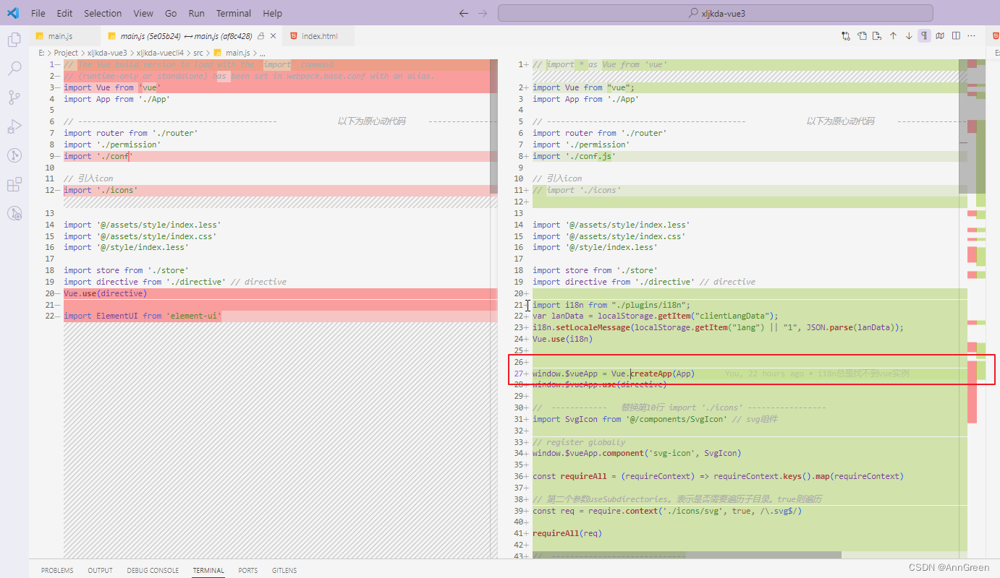

4. 使用工具把代码从 ElementUI 转换成 Element Plus
使用 gogocode-element-plugin 插件把项目代码从 ElementUI 升级到 Element Plus

```
gogocode -s ./src -t gogocode-plugin-element  -o ./src
```

5. 手动修改package.json，package.json，element-ui 换成 element-plus，如果使用了图标，@element-plus/icons 也需要安装

```js
// 引入（之前elementui的就不需要了）
import ElementPlus from 'element-plus'
import 'element-plus/theme-chalk/index.css'
```

6. 升级依赖和构建
每个人的构建环境不同，可以通过下面的命令更新 package.json 里面的 vue 和 vue-cli 的版本号

```
gogocode -s ./package.json -t gogocode-plugin-vue  -o ./package.json
```

7. 启动项目，根据报错提示一一修改

###### 期间遇到的问题

1. Cannot read properties of undefined (reading ‘install‘) at Vue.use
gogocode编译代码有问题，在main.js中（提示找不到Vue实例的都可以看一下是不是这个原因）

```js
import * as Vue from 'vue'

...

window.$vueApp = Vue.createApp(App)
```

改为

```js
import {
    createApp
} from "vue";

...

window.$vueApp = createApp(App)
```

2. vue-i18问题
需要升级vue-i18n至0.9.5，不要使用旧版本的vue-i18n，新版本的vue-i18n使用已经更改

```js
// 原vue-i18n使用
import VueI18n from 'vue-i18n'
import Vue from 'vue'

// window.$vueApp.use(VueI18n)

const i18n = new VueI18n({
    locale: localStorage.getItem('lang') || '1',
})
export default i18n

// vue-i18n 0.9.5使用方法
import {
    createI18n
} from "vue-i18n";

const i18n = createI18n({
    legacy: false,
    locale: localStorage.getItem("lang") || "1", // 默认显示语言
    messages: {
        '1': localStorage.getItem("clientLangData"),
    },
});

export default i18n;
```

新版vue-i18n设置语言api也需更改

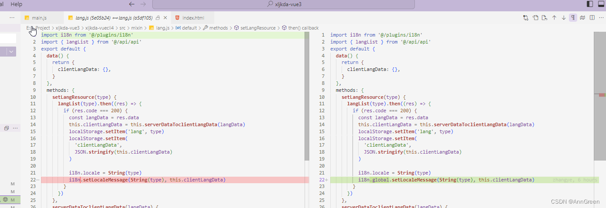

3. 路由问题：Catch all routes (“*“) must now be defined using a param with a custom regexp.
router4必须使用自定义的 regex 参数来定义所有路由(*、/*)：

```js
  {
      path: "/:catchAll(.*)*",
      component: Notfound,
      hidden: true
  }
```

参考：[https://router.vuejs.org/zh/guide/migration/](https://router.vuejs.org/zh/guide/migration/)

4. this.$store.state.xxx获取不到？
需要在mount之前use(store)

5. 插槽问题：v-slot‘ directive must be owned by a custom element, but ‘div‘ is not
目前先注释代码，没有问题，后续看一下v-slot新用法

6. v-if/else的问题
7. 

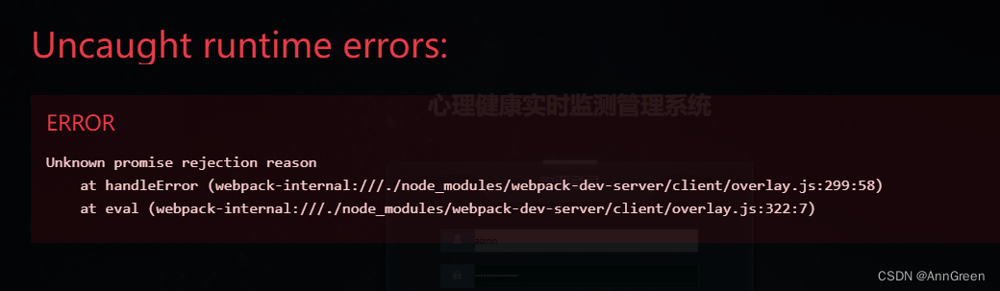

解决办法，添加webpack配置  overlay: false
https://blog.csdn.net/ligaoming_123/article/details/131939973

```js
devServer: {
    client: {
        overlay: false,
    },
},
```

## gogocode做了哪些事情？

beforeDestroy-beforeUnmount生命周期

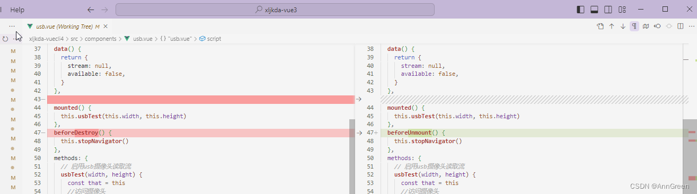

emit方式变化

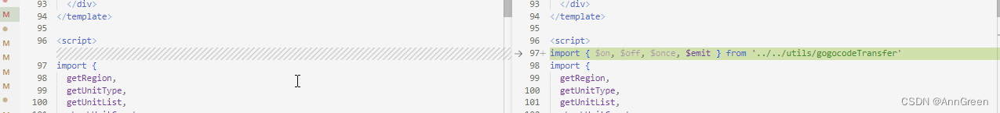

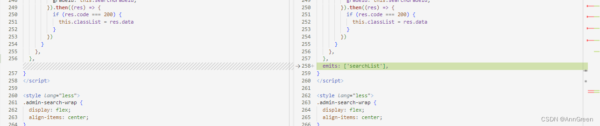

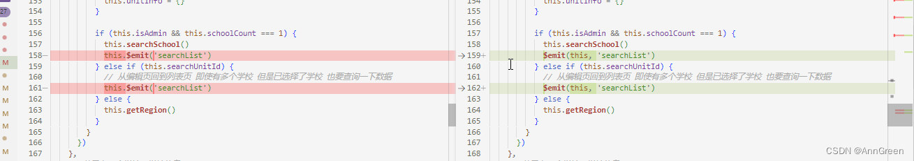

filter替代方案

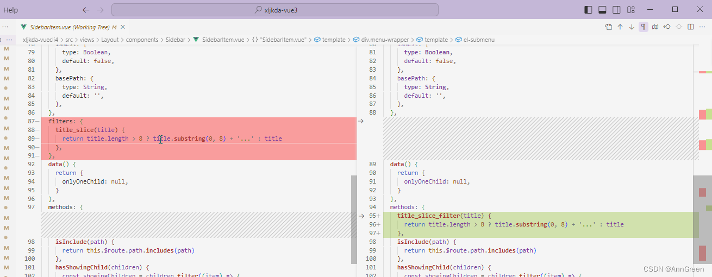

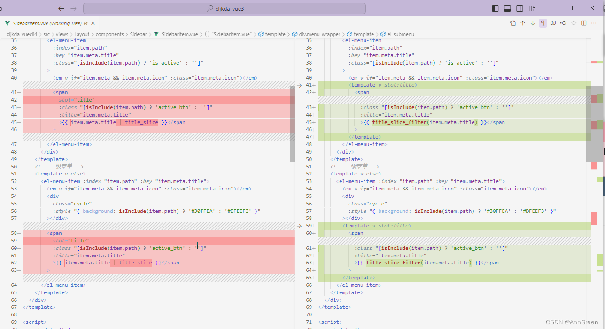

v-model的更改，参考https://v3-migration.vuejs.org/zh/breaking-changes/v-model.html

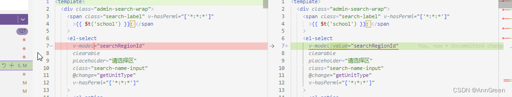

$set()

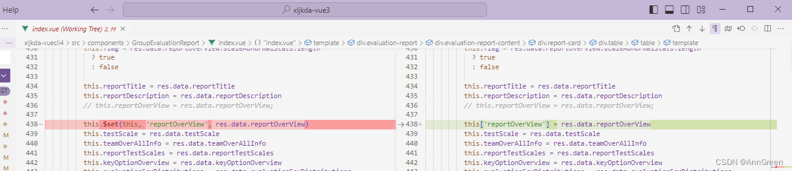

gogocode的需要优化的地方
编译后样式混乱（已经不符合语法），直接error，项目启动直接失败

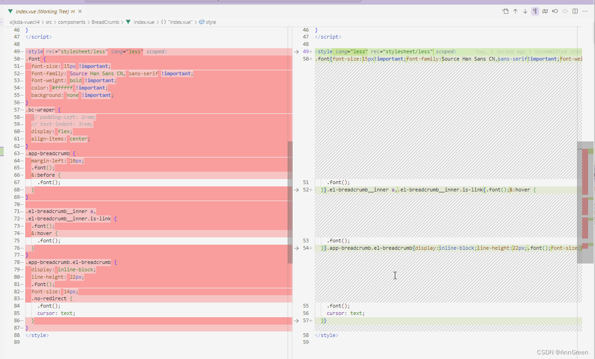

至此项目已经可以正常打包运行，但是基本上每个页面样式都存在问题需要修改。
参考：
Vue3迁移指南：[https://v3-migration.vuejs.org/](https://v3-migration.vuejs.org/)
Vue CLI创建一个项目：[https://cli.vuejs.org/zh/guide/creating-a-project.html](https://cli.vuejs.org/zh/guide/creating-a-project.html)
Vue3 v-model 变更：[https://blog.csdn.net/qq_38290251/article/details/112146427](https://blog.csdn.net/qq_38290251/article/details/112146427)
Router4 从Vue2迁移：[https://router.vuejs.org/zh/guide/migration/](https://router.vuejs.org/zh/guide/migration/)
vue2老项目升级vue3落地实践(一)：[https://juejin.cn/post/7174424073575858236](https://juejin.cn/post/7174424073575858236)
Vue2 升级 Vue3 - 过程记录：[https://juejin.cn/post/7209863093671755835](https://juejin.cn/post/7209863093671755835)
